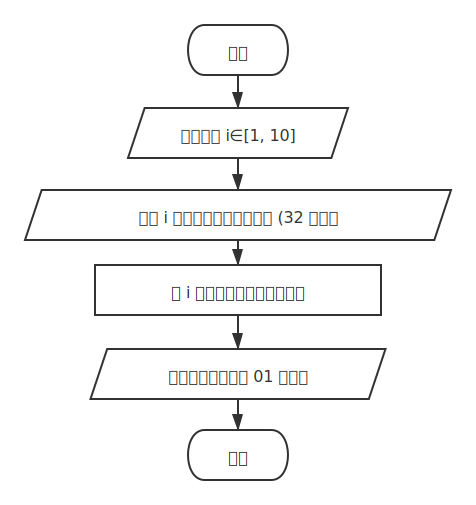
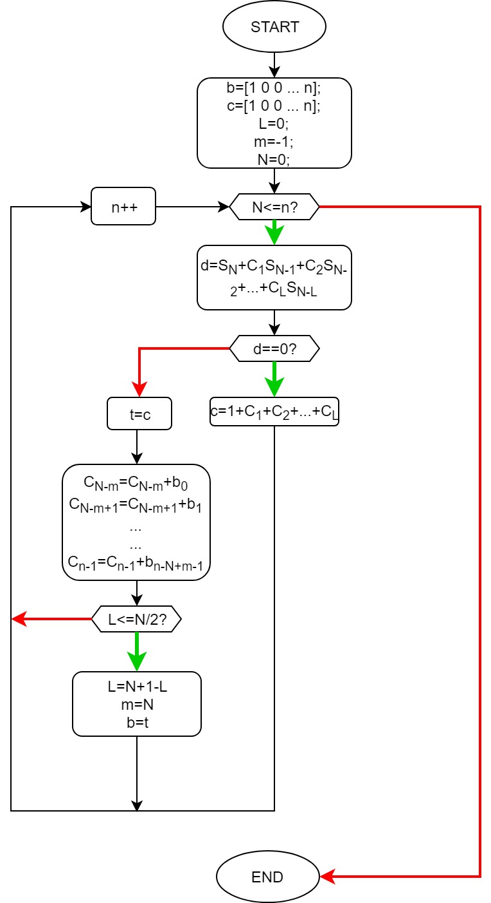
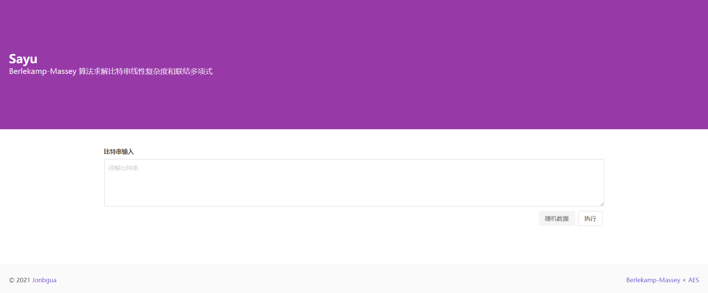
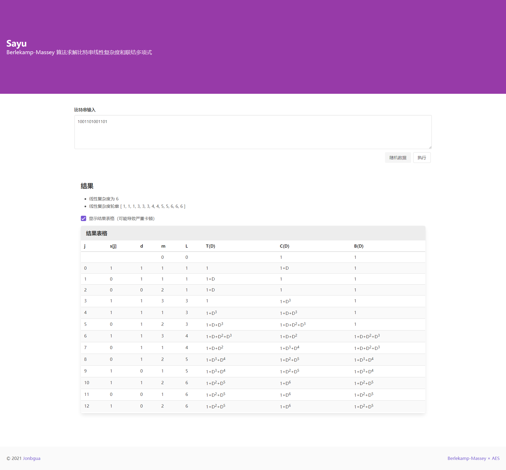
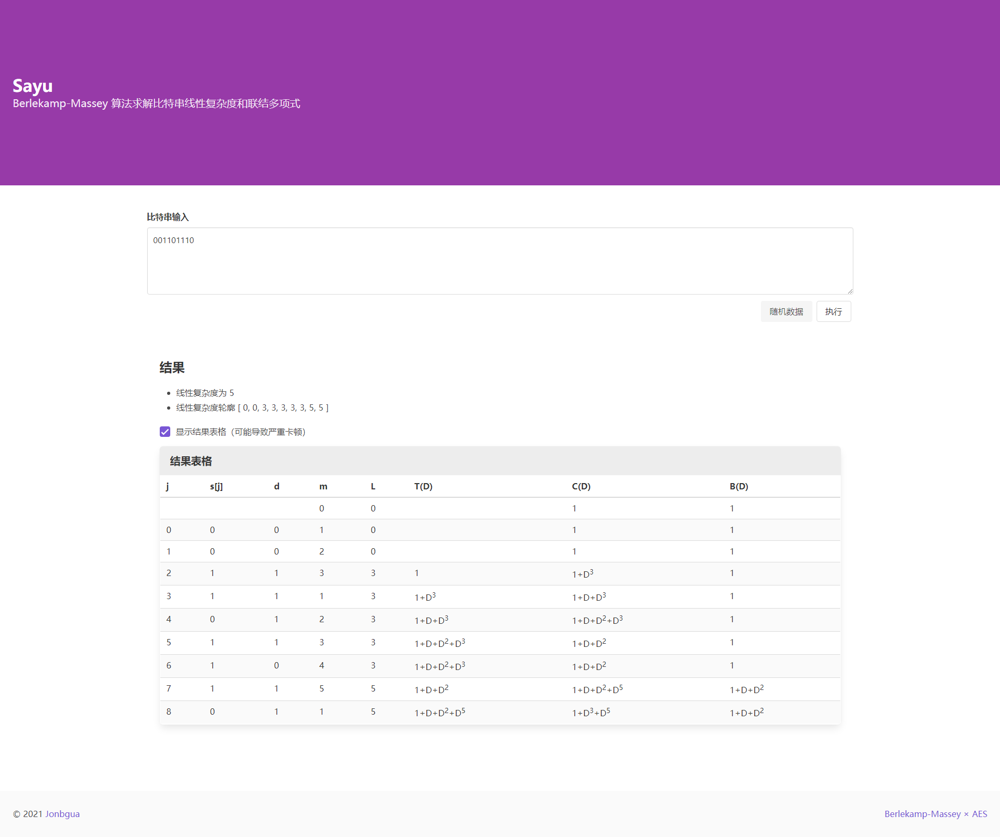
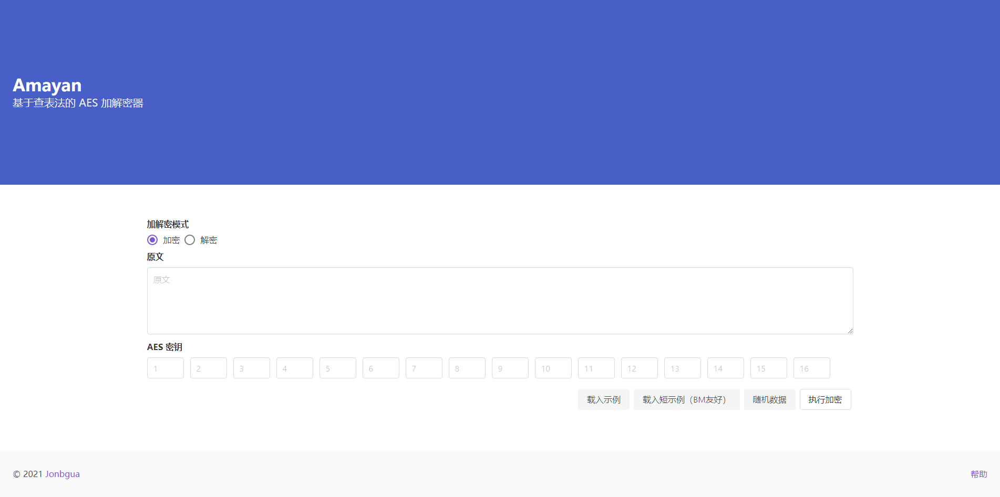
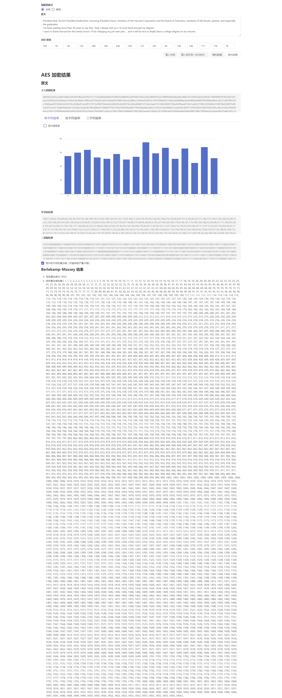

# Sayu

[Sayu](https://sayu.jonbgua.com/) 是一个使用 Berlekamp-Massey 算法求解比特串线性复杂度和联结多项式的 网页应用，系《密码学导论》课程的大作业之三。

## 流程图

### 载入示例

其中，密码学安全的随机数由 `Crypto.getRandomValues()` 函数提供，详见 [MDN Web Docs](https://developer.mozilla.org/zh-CN/docs/Web/API/Crypto/getRandomValues) 上的说明。

### Berlekamp-Massey 算法

算法逻辑参考了上课的 PPT 与 [Stack Overflow](https://stackoverflow.com/questions/50517576/berlekamp-massey-minimal-lfsr-issues)（如下图）等。

## 效果预览

### 主界面

### PPT 提供的样例

#### 样例 1

PPT Page 72：`1001101001101`。

#### 样例 2

PPT Page 49：`001101110`。

### 与 AES 的联动

本节将介绍如何进行 AES 加密并求解加密结果比特串的线性复杂度和联结多项式。为实现此目的，我们将 Sayu 的 Berlekamp-Massey 模块直接嵌入到了 Amayan 项目中。

点击 Sayu 右下角的 [Berlekamp-Massey × AES](https://aes.jonbgua.com) 链接或直接访问 https://aes.jonbgua.com ，进入 Amayan 项目。

点击「载入短示例（BM友好）」，并「执行加密」。（完整示例易导致浏览器进程因长期处于运算状态而假死）

**注意：因为 AES 密钥每次都是随机生成，故复现的结果与图中结果可能有不同。**

不建议点击「显示结果表格」，因单页渲染的元素过多，可能会导致浏览器假死。

## 参考

- [mjcross/mod2MatrixTools - GitHub](mjcross/mod2MatrixTools - GitHub)
- [Berlekamp-Massey minimal LFSR issues - Stack OverFlow](https://stackoverflow.com/questions/50517576/berlekamp-massey-minimal-lfsr-issues)

